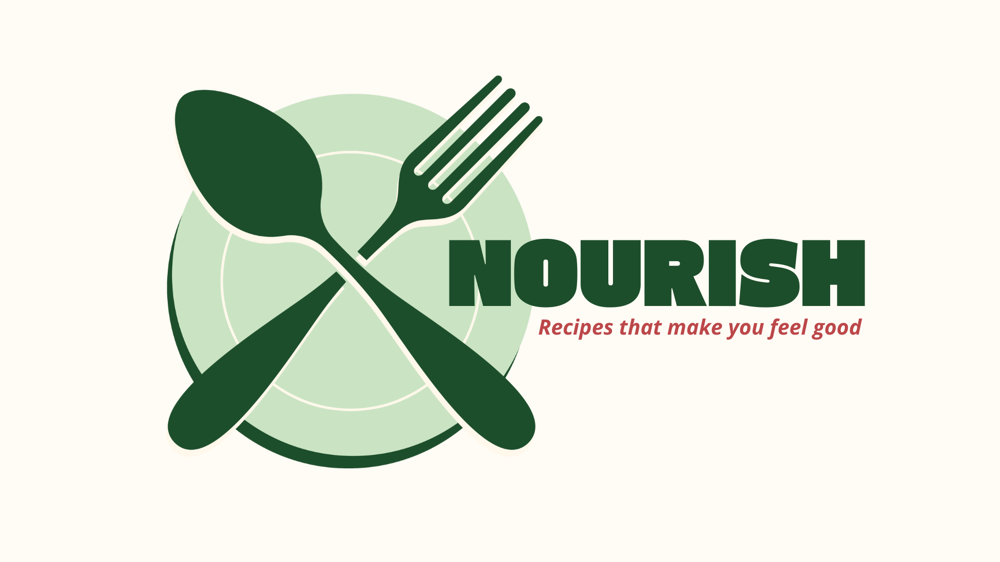
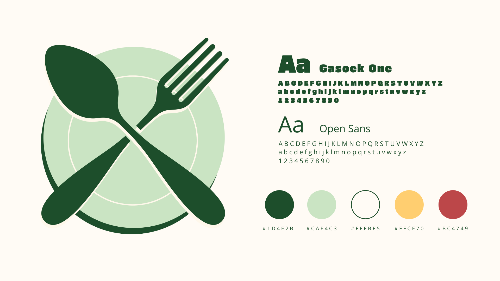
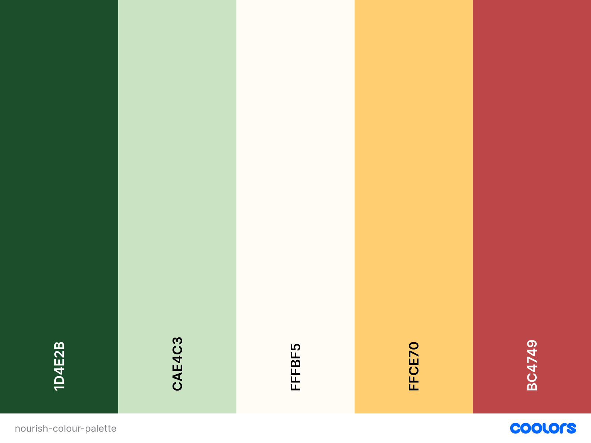

# Nourish

## Introduction 

...

<a href="..." target="_blank">View the live project here.</a>

## UX Design

### Site Owner’s Goal

...

### User Stories

The user stories for this project as well as their acceptance criteria and tasks can be found in the <a href="..." target="_blank">project board</a>.

* As a ...

### Wireframes

...

#### Mobile

#### Desktop

### Branding

#### Fonts

...

#### Colour Palette

...

#### Imagery

...

### Responsiveness

...

## Features
### Existing Features

#### ...

...

### Future Changes

...

* ...

## Built With

* ...

## AI Implementation and Orchestration

### Use Cases and Reflections:

...

- **Code Creation:** 
  - ...
  - ...

- **Debugging:** 
  - ...

- **Performance and UX Optimization:** 
  - ...

- **Automated Unit Testing:**
  - ...

### Overall Impact:
...

## Deployment

- **Platform:** Heroku
- **High-Level Deployment Steps:** 
  1. Clone the repository
  2. Set up the Heroku environment with a PostgreSQL database.
  3. Configure environment variables for sensitive data (e.g., secret keys).
  4. Deploy using Heroku Git or GitHub integration.
- **Verification and Validation:**
  - Tested the deployed application against the development environment for consistent functionality and design.
  - Verified accessibility using tools such as Lighthouse and manual testing.
- **Security Measures:**
  - Sensitive data is stored in environment variables.
  - DEBUG mode is disabled in the production environment to enhance security.

<a href="..." target="_blank">View the live project here.</a>

## Testing

...

### Manual Testing

...

### Validator Testing

...

...

### JavaScript Testing

...

### Lighthouse

...

## Credits
### Code
* ...

### Content
* ...

### Media
* ...

