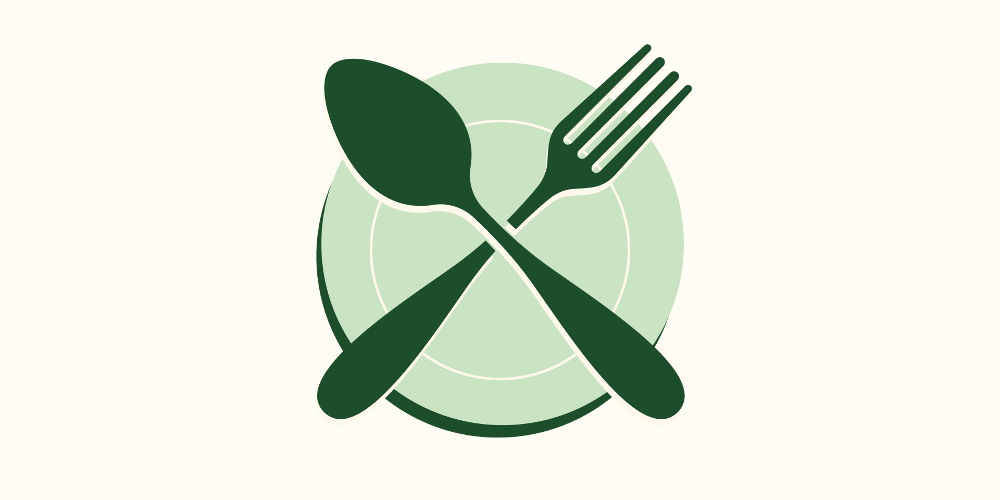
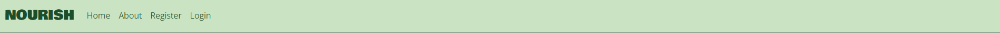
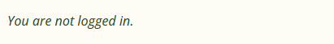
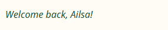

# Nourish

## Introduction 

Nourish is an attractive and user-friendly web application built to share and discover delicious recipes. The site allows authorised users to log in and publish recipes to Nourish, and allows site visitors to browse recipes for that all-too-needed meal inspo. This Full Stack Individual Capstone Project marks the culmination of everything learnt while studying at the Code Institute. Nourish combines and demonstrates:

* Frontend Development: HTML, CSS, JavaScript
* Backend Development: Python, Django framework
* Database Management: PostgreSQL, integrated through Django ORM
* Agile Methodology: Project planning and tracking using Agile principles
* Version Control: Git & GitHub
* Deployment: Heroku
* AI Integration: Harnessing AI tools in the development process.

<a href="https://nourish-recipes-0c552fcf97d0.herokuapp.com/" target="_blank">View the live project here.</a>

## UX Design

### Site Owner’s Goal

The Nourish site owner's goal is to create a user-friendly online platform that inspires users to explore the joy of cooking and discover new recipes for every occasion. Nourish aims to be more than just a recipe collection—it will foster a sense of community by enabling users to connect, share feedback, leave reviews, and swap cooking tips.

The site will be built using HTML, CSS, JavaScript, Python, and the Django framework to create a site that users will want to keep coming back to. It will focus on fostering connections between food enthusiasts while showcasing the site’s core values: sharing good food and great ideas.

### User Stories

The full user stories for this project, along with their acceptance criteria and tasks, can be found on the <a href="https://github.com/users/katee145/projects/13" target="_blank">project board</a>. Below are the user stories deemed essential to achieving the minimum viable product (MVP):

* As a site visitor, I want to be able to access the recipe website on multiple devices (desktop, mobile, tablet) so that I can use it anytime, anywhere.
* As a recipe website administrator, I want to be able to easily add, edit, and delete recipes so that I can keep the content fresh and up-to-date.
* As a recipe website administrator, I want to be able to moderate user-generated content so that I can ensure the quality and appropriateness of reviews and comments.
* As a site visitor, I want to be able to easily browse and find recipes so that I can discover new and delicious dishes.
* As a user with dietary restrictions, I want to be able to filter recipes so that I can easily find recipes that are suitable for my needs.
* As a user looking for useful recipes, I want to be able to view detailed recipe information so that I can easily follow the instructions and understand the ingredients.
* As someone who has used a recipe, I want to be able to contribute to the recipe website by submitting my comments as feedback after making a recipe.

### Access Control

The table below outlines access control for each user type, covering both the site’s front end and admin panel:

| Access                            | Superuser | Staff user | Signed in user | Signed out user |
|-----------------------------------|-----------|------------|----------------|-----------------|
| Can view comments on a recipe     | Y         | Y          | Y              | Y               |
| Can comment on a recipe           | Y         | Y          | Y              | N               |
| Can edit their own comment on a recipe | Y     | Y          | Y              | N               |
| Can delete their own comment on a recipe | Y     | Y          | Y              | N               |
| Can log in to the admin panel     | Y         | Y          | N              | N               |
| Can manage users in admin panel   | Y         | N          | N              | N               |
| Can manage posts in admin panel   | Y         | Y          | N              | N               |
| Can manage comments in admin panel| Y         | Y          | N              | N               |

### User Flow Diagram

The user flow diagram illustrates how unauthorised (non-staff) users navigate the site. For simplicity, it assumes the user begins by deciding whether they have an account. In practice, many users will land directly on a specific recipe page they are searching for.

### Branding

#### Fonts

This project uses 'Bowlby One' for headings and 'Open Sans' for body text. Both fonts are sourced from Google Fonts and there is a backup of 'sans-serif' applied on the site.

#### Colour Palette

The colour palette for Nourish was carefully selected to align with the brand's purpose as a recipe site. The colours ensure a user-friendly experience, balancing attractiveness with accessibility standards.

View colour palette

#### Imagery

All photography used on the Nourish site, including recipe images and staff photos, was sourced from Unsplash, ensuring high-quality visuals that align with the site’s aesthetic.

The brand logo was designed using Canva, carefully crafted to complement the site’s overall branding and color palette, reinforcing a cohesive and appealing identity.

View logo

### Wireframes
The wireframes for the Nourish site were created using Canva to visually map out the layout and design for both mobile and desktop screens. These wireframes served as a foundational guide for the site’s development, ensuring a consistent and user-friendly interface across devices.

Homepage

About

Recipe

Errors

Account

### Responsiveness

Nourish is designed to be fully responsive across all device sizes, ensuring an optimal user experience whether accessed on mobile, tablet, or desktop. The design follows a mobile-first approach, based on the hypothesis that the majority of users browse recipes on their smartphones.

To achieve this, the layout adapts seamlessly to different screen sizes using a combination of Bootstrap's grid system and Flexbox, applied strategically to maintain consistency and usability across devices.

## Agile

The development of the Nourish project followed Agile methodology, focusing on iterative improvements, flexibility, and user-centered design. The project was broken down into 'must have', 'should have' and 'could have' functionality to determine which features would deliver a functional minimum viable product (MVP).

A <a href="https://github.com/users/katee145/projects/13" target="_blank">GitHub Project Board</a> was used to effectively plan, track, and manage tasks, with cards representing user stories, acceptance criteria, and sub-tasks. The board utilised the columns 'Backlog', 'To Do', 'In Progress', and 'Done' to provide a clear visual representation of progress throughout the project.

Regular reviews and retrospectives were conducted throughout to evaluate progress and prioritise next tasks to deliver the site within the allotted time frame.

## Entity Relationship Diagram
The Entity Relationship Diagram (ERD) below outlines the relationships between the site's models.

## Features
### Existing Features

#### Navigation

...

View

#### Login Notice

...

View

#### Masthead

...

View

#### Search

...

View

#### Recipe Cards

...

View

#### Navigation buttons

...

View

#### Recipe

...

View

#### Comments

...

View

#### Notification

...

View

#### About

...

View

#### 404

...

View

#### Login

...

View

#### Logout

...

View

#### Register

...

View

### Future Changes

* Flagging inappropriate comments
* Notification that you comment has been approved 
* Save recipesand have a profile 

## Built With

* ...

## AI Implementation and Orchestration

### Use Cases and Reflections:

...

- **Code Creation:** 
  - ...
  - ...

- **Debugging:** 
  - ...

- **Performance and UX Optimisation:** 
  - ...

- **Automated Unit Testing:**
  - ...

### Overall Impact:
...

## Deployment

- **Platform:** Heroku
- **High-Level Deployment Steps:** 
  1. Clone the repository
  2. Set up the Heroku environment with a PostgreSQL database.
  3. Configure environment variables for sensitive data (e.g., secret keys).
  4. Deploy using Heroku Git or GitHub integration.
- **Verification and Validation:**
  - Tested the deployed application against the development environment for consistent functionality and design.
  - Verified accessibility using tools such as Lighthouse and manual testing.
- **Security Measures:**
  - Sensitive data is stored in environment variables.
  - DEBUG mode is disabled in the production environment to enhance security.

<a href="https://nourish-recipes-0c552fcf97d0.herokuapp.com/" target="_blank">View the live project here.</a>

## Testing

...

### Manual Testing

| Browser          | Functioning? (Y/N) | Responsive? (Y/N) |
|------------------|--------------------|-------------------|
| Google Chrome    | Y                  | Y                 |
| Safari           | Y                  | Y                 |
| Bing             | Y                  | Y                 |
| Microsoft Edge   | Y                  | Y                 |
| Firefox Mozilla  | Y                  | Y                 |
| Opera GX         | Y                  | Y                 |

#### Test Scope

Manual testing was carried out on the website to ensure full functionality. I have focused on specifically the ability to comment then edit and delete your own comment, and the risk. The following was identified as the potential risks given the scope of the site. 

#### Risk testing

The following were identified as risks:

Regisering with a username that is already taken

Registering with an insecure password

Unauthorised users accessing admin panel

Unauthorised users accessing user permissions

Risk of being able to edit delete other peoples comments

Risk of being able to submit and/or edit an empty comment

#### Comment functionality
The journey of wanting to comment, creating an account, to commenting then editng and deleting
Risk of being able to comment not logged in
Risk of being able to post an empty comment

User is not signed into an account so cannot submit a comment on a recipe
 

User is able to create an account when: they have a unique username, they have a secure password, they have entered the same password, all required fields are complete
 

User is notified of their login
 

User can submit a comment on a recipe
 

User is notified that their comment is awaiting approval
 

Admin can view new user account
 

User has no admin permissions
 

Admin and staff can approve user's comment
 

User can view and edit comment once approved
 

User is notified that their comment has been updated
 

User can delete their comment
 

User is notified that their comment has been deleted
 

User's comment has been deleted
 

Admin can delete user's account
 

### External Testing and Validation

#### HTML

Homepage

About

Recipe

No search results

404

Logout

Login

Register

The HTML validation errors on the registration page are a result of using allauth.

#### CSS

CSS Validation

CSS Warnings

#### JavaScript

JSHint

The undefined variable is a result of using Bootstrap library.

#### Python

admin.py

apps.py

asgi.py

forms.py

models.py

settings.py

tests.py

config/urls.py

nourish_home/urls.py

views.py

wsgi.py

#### Lighthouse

Homepage: Desktop

Homepage: Mobile

About: Desktop

About: Mobile

Recipe: Desktop

Recipe: Mobile

No search results: Desktop

No search results: Mobile

404: Desktop

404: Mobile

Logout: Desktop

Logout: Mobile

Login: Desktop

Login: Mobile

Register: Desktop

Register: Mobile

#### WAVE Accessibility

Homepage

About

Recipe

No search results

404

Logout

Login

Register

## Credits
### Code

* The GitHub project was built using the Code Institute template to start.
* The Code Institute's 'Codestar' was used for the site's foundational code, CRUD functionality, comment model, and general inspiration of blog functionality.

### Content
* AI

### Media
* Canva
* Unsplash

## Acknowledgements

A huge thank you to the Code Institute staff team for their support throughout, in particular Dillon, Roo, and John.